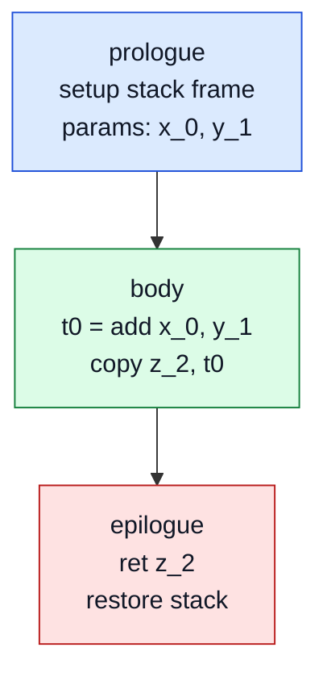
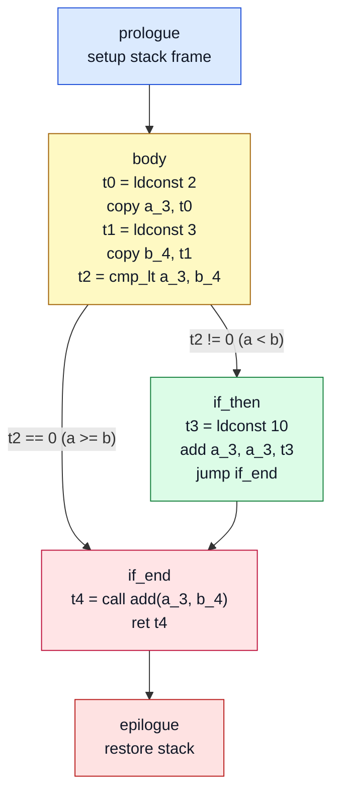

# MAINTENANCE

Ce fichier est volontairement une documentation technique complète du projet.
Il peut être lu comme un manuel d'architecture + pseudo-code de référence.

Objectif principal:

- expliquer clairement le rôle de chaque module
- expliciter les variables d'état importantes
- donner un pseudo-code pour chaque fonction clé des passes sémantique et IR

---

## 1) Vue d'ensemble du compilateur

Le compilateur suit 4 étapes strictes.

1. Parsing

- Fichier: `compiler/ifcc.g4`
- Entrée: source C simplifié
- Sortie: AST ANTLR

2. Vérification sémantique

- Fichiers: `compiler/src/SymbolVisitor.h`, `compiler/src/SymbolVisitor.cpp`
- Entrée: AST
- Sortie: erreurs/warnings + tables (`SymbolTable`, `FunctionTable`)

3. Génération IR + CFG

- Fichiers: `compiler/src/IRVisitor.h`, `compiler/src/IRVisitor.cpp`
- Entrée: AST valide + tables sémantiques
- Sortie: un CFG par fonction, représentation intermédiaire du code.

4. Backend

- Fichiers: `compiler/src/backend.h`, `compiler/src/backend.cpp`
- Entrée: CFG/IR
- Sortie: assembleur final

Point d'entrée runtime du compilateur:

- `compiler/main.cpp`

---

## 2) Langage supporté (scope officiel)

### 2.1 Types et fonctions

- types de retour: `int`, `void`
- paramètres: uniquement `int x`
- arité max vérifiée: 6 arguments

### 2.2 Déclarations

- déclaration simple: `int a;`
- déclaration avec init: `int a = expr;`
- déclaration multiple: `int a, b = 1, c;`
- déclaration + assignment dans la même liste: `int a, b = 1, c = b + 2;`
- déclaration possible dans tout bloc

### 2.3 Expressions supportées

- constantes: `INT`, `CHAR`
- variable
- appel de fonction
- affectations: `=`, `+=`, `-=`, `*=`, `/=`
- unaires: `!`, `-`
- pré/post inc-dec: `++x`, `x++`, `--x`, `x--`
- binaires arithmétiques: `+ - * / %`
- comparaisons: `< <= > >= == !=`
- bitwise: `& ^ |`
- logiques court-circuit: `&& ||`

### 2.4 Contrôle de flux supporté

- `if / else`
- `while`
- `switch / case / default`
- `break`, `continue`
- `return`

### 2.5 Features explicitement non supportées (parmi les facultatifs)

- pointeurs (`*`, `&`)
- tableaux (`a[i]`, déclaration tableau)
- doubles
- propagation de constantes

De plus, ous avons décidé de ne pas implémenter les fonctionnalités non prioritaires et déconseillées.

---

## 3) Structures de données

### 3.1 VariableInfo (`compiler/src/SymbolTable.h`)

```text
name        : nom source (pour messages warning/erreur)
index       : offset pile de la variable
isUsed      : true si la variable est lue/écrite
declLine    : ligne de déclaration (pour warning unused)
```

Utilité pratique:

- `name` conserve le nom original de la variable pour les diagnostics
- `index` sert au placement stack
- `isUsed` + `declLine` servent au warning de fin d'analyse

### 3.2 FunctionInfo

```text
returnType       : Int ou Void
arity            : nombre de paramètres
paramUniqueNames : noms internes scopes des paramètres
```

Utilite pratique:

- verification d'appels (existence + arité)
- mapping cohérent entre front-end sémantique et IR/backend

### 3.3 ScopeTable

Définition logique:
`ScopeTable = vector<map<nom_source, nom_unique>>`

Utilite pratique:

- gère le masquage de variables (shadowing)
- permet une résolution de nom O(nombre_de_scopes)

Pseudo-code de résolution:

```text
resolve(name):
  pour i de dernier_scope à premier_scope:
    si name existe dans scope[i]:
      retourner scope[i][name]
  retourner not_found
```

---

## 4) SymbolVisitor: specification détaillée

`SymbolVisitor` est la passe de cohérence sémantique.
Chaque visiteur d'expression retourne un type logique interne:

- `TYPE_INT`
- `TYPE_INVALID`

Signification:

- `TYPE_INT`: expression semantiquement valide qui produit un entier utilisable (dans une affectation, un calcul, une condition, etc.).
- `TYPE_INVALID`: expression invalide apres detection d'erreur semantique (variable non declaree, appel incorrect, types incompatibles, ...). Cette valeur permet de continuer l'analyse sans planter et d'eviter les erreurs en cascade.

Pourquoi c'est nécessaire :

Problèmes evités:

1. Crash ou erreur de conversion type `Any`

- Si une visite retourne une valeur inattendue, la conversion peut échouer.
- La fonction de garde attrape ça et force un état invalide au lieu de casser l'analyse (fallback `TYPE_INVALID`).

2. Cascade de messages d'erreurs inutiles

- Quand une sous-expression est déja mauvaise, on la marque `TYPE_INVALID`.
- Les parents n'ajoutent pas de faux messages "type incompatible" sur la même cause racine.

2. Analyse qui continue jusqu'au bout du fichier

- Meme apres une erreur locale, le visiteur continue à vérifier retours, conditions, appels, etc.
- On remonte ainsi plusieurs vraies erreurs en un seul run.

3. Convention homogene de retour pour les expressions

- Sans le couple `TYPE_INT` / `TYPE_INVALID`, il faudrait des cas spéciaux partout.
- Avec ce schéma, toutes les visites (unaires, binaires, appels, conditions) suivent la même règle.

Version très simple a retenir:

- `TYPE_INT` = expression correcte
- `TYPE_INVALID` = expression déjà en erreur, on continue sans polluer les diagnostics

### 4.1 Variables d'état (membres)

```text
table                     : SymbolTable globale des variables uniques
functionTable             : signatures des fonctions
scopeTable                : pile de scopes
currentOffset             : offset pile courant (décroît de 4 en 4)
uniqueVarId               : compteur pour suffixes _0, _1, _2
hasError                  : drapeau global d'erreur sémantique
currentFunctionName       : nom de la fonction en cours
currentFunctionReturnType : type attendu de return
loopDepth                 : profondeur while
switchDepth               : profondeur switch
```

### 4.2 Helpers

#### `resolveVariable(originalName)`

Responsabilité:

- trouver le nom interne visible depuis le scope courant.

Pseudo-code:

```text
resolveVariable(name):
  pour i de scopeTable.size-1 à 0:
    si name dans scopeTable[i]:
      retourner scopeTable[i][name]
  retourner ""
```

#### `lookupVariableInfo(originalName)`

Responsabilité:

- obtenir `VariableInfo*` en partant d'un nom source.

Pseudo-code:

```text
lookupVariableInfo(name):
  unique = resolveVariable(name)
  si unique == "": retourner null
  si unique absent de table: retourner null
  retourner &table[unique]
```

#### `checkUnusedVariables()`

Responsabilité:

- émettre les warnings `unused` en fin de passe.

Pseudo-code:

```text
checkUnusedVariables():
  pour chaque (uniqueName, info) dans table:
    si info.isUsed == false:
      afficher warning avec nom de base et ligne
```

### 4.3 Fonctions visitées, une par une

#### `visitProg`

Responsabilité:

- prédéclarer toutes les signatures de fonction
- détectér doublons
- imposer présence de `main`
- visiter ensuite chaque fonction
- lancer le scan `unused`

Pseudo-code:

```text
visitProg(ctx):
  pour fn dans programme:
    si fn.nom deja dans functionTable:
      erreur doublon
    sinon:
      functionTable[fn.nom] = {returnType, arity, [], []}

  si main absente:
    erreur

  pour fn dans programme:
    visit(fn)

  checkUnusedVariables()
```

#### `visitFunction_decl`

Responsabilité:

- initialiser le contexte fonction
- créer le scope des paramètres
- allouer les paramètres en locals internes

Pseudo-code:

```text
visitFunction_decl(ctx):
  currentFunctionName = ctx.nom
  currentFunctionReturnType = parseReturnType(ctx.type)
  push scope local fonction

  reset paramUniqueNames pour cette signature

  pour param dans ctx.params:
    si param.nom deja dans scope courant:
      erreur
      continue

    unique = param.nom + "_" + uniqueVarId++
    scopeTable.top[param.nom] = unique

    currentOffset -= 4
    table[unique] = {index=currentOffset, isUsed=false, declLine=ligne}

    enregistrer unique dans functionTable

  visit(ctx.block)
  pop scope
```

#### `visitBlock`

Responsabilité:

- ouvrir/fermer un scope lexical

Pseudo-code:

```text
visitBlock(ctx):
  push scope
  pour stmt dans ctx.stmts:
    visit(stmt)
  pop scope
```

#### `visitDeclare_stmt`

Responsabilité:

- parcourir la liste des éléments de déclaration (`declare_elmt`)
- déléguer la validation/création variable à `visitDeclare_elmt`

Pseudo-code:

```text
visitDeclare_stmt(ctx):
  pour elmt dans ctx.declare_elmt:
    visit(elmt)
```

#### `visitDeclare_elmt`

Responsabilité:

- gérer un élément `VAR` simple
- gérer un élément `assign_stmt` (déclaration + assignment dans la même ligne)

Pseudo-code:

```text
visitDeclare_elmt(ctx):
  si ctx est VAR:
    registerVariable(VAR, line)
    return

  si ctx est assign_stmt:
    registerVariable(VAR, line)
    visit(assign_stmt)
```

#### `visitAssign_stmt`

Responsabilité:

- typer/vérifier l'initialisation de type `VAR = expr` a l'intérieur d'une déclaration.

Pseudo-code:

```text
visitAssign_stmt(lhs, rhs):
  visit(rhs)
  unique = resolveVariable(lhs)
  si unique introuvable: erreur
  table[unique].isUsed = true
  return TYPE_INT
```

#### `visitReturn_stmt`

Responsabilité:

- valider la cohérence `return` avec le type de la fonction courante.

Pseudo-code:

```text
visitReturn_stmt(ctx):
  si fonction void:
    si expr presente: erreur
    si expr presente: visit(expr)
    retourner

  # fonction int
  si expr absente: erreur
  sinon: visit(expr)
```

#### `visitParensExpr`, `visitConstExpr`, `visitVarExpr`

Responsabilité:

- propagation des types de base.

Pseudo-code:

```text
visitParensExpr: return visit(expr)
visitConstExpr : return TYPE_INT

visitVarExpr(name):
  unique = resolveVariable(name)
  si unique introuvable: erreur; return TYPE_INVALID
  table[unique].isUsed = true
  return TYPE_INT
```

#### `visitAssignExpr`

Responsabilité:

- vérifier lhs déclarée
- vérifier rhs de type entier
- marquer lhs comme utilisée

Pseudo-code:

```text
visitAssignExpr(lhs, op, rhs):
  visit(rhs)
  unique = resolveVariable(lhs)
  si unique introuvable: erreur; return TYPE_INVALID
  table[unique].isUsed = true
  return TYPE_INT
```

#### `visitMultDivModExpr`

Responsabilité:

- verifier types des 2 opérandes
- warning division/modulo par zéro constant

Pseudo-code:

```text
visitMultDivModExpr(lhs, op, rhs):
  visit(lhs)
  visit(rhs)

  si rhs est constante ET (op == / OU op == % ) ET rhs == 0:
    warning

  return TYPE_INT
```

#### `visitPreIncDecVarExpr`, `visitPostIncDecVarExpr`

Responsabilité:

- exiger une variable déclarée, marquer usage.

Pseudo-code:

```text
visitPre/PostIncDecVarExpr(var):
  unique = resolveVariable(var)
  si introuvable: erreur; return TYPE_INVALID
  table[unique].isUsed = true
  return TYPE_INT
```

#### `visitUnitaryExpr`, `visitAddSubExpr`, `visitCompareExpr`, `visitEqualExpr`, `visitLogicBitANDExpr`, `visitLogicBitXORExpr`, `visitLogicBitORExpr`, `visitLogicANDExpr`, `visitLogicORExpr`

Responsabilité:

- schéma homogène: visiter les operandes (validation sémantique), retourner int.

Pseudo-code commun:

```text
visitBinaryLike(lhs, rhs):
  visit(lhs)
  visit(rhs)
  return TYPE_INT

visitUnaryLike(expr):
  visit(expr)
  return TYPE_INT
```

#### `visitCallExpr`

Responsabilité:

- vérifier contraintes d'appel builtins/user
- vérifier arité
- interdire utilisation d'une fonction void comme expression
- visiter les arguments (pour propager leurs vérifications sémantiques)

Pseudo-code:

```text
visitCallExpr(funcName, args):
  argc = args.size
  si argc > 6: erreur

  si funcName == putchar:
    si argc != 1: erreur
  sinon si funcName == getchar:
    si argc != 0: erreur
  sinon:
    si fonction absente: erreur
    sinon si arité != argc: erreur
    si returnType == void ET appel utilise comme expression:
      erreur

  pour arg dans args:
    visit(arg)

  return TYPE_INT
```

#### `visitBreak_stmt`, `visitContinue_stmt`

Responsabilité:

- valider l'usage de `break` et `continue` selon la profondeur de boucle/switch.

Pseudo-code:

```text
visitBreak_stmt:
  si loopDepth == 0 ET switchDepth == 0: erreur

visitContinue_stmt:
  si loopDepth == 0: erreur
```

#### `visitWhile_stmt`

Responsabilité:

- valider l'expression de condition et le corps de boucle dans le bon contexte.

Pseudo-code:

```text
visitWhile_stmt(cond, body):
  visit(cond)
  loopDepth++
  visit(body)
  loopDepth--
```

#### `visitSwitch_stmt`

Responsabilité:

- valider l'expression du switch
- détecter les `case` dupliqués et les `default` multiples
- visiter les instructions de chaque section

Pseudo-code:

```text
visitSwitch_stmt(expr, parts):
  visit(expr)

  switchDepth++
  seenCases = {}
  hasDefault = false

  pour part dans parts:
    si part est case:
      value = valeur case
      si value dans seenCases: erreur
      ajouter value
    sinon si part est default:
      si hasDefault: erreur
      hasDefault = true
    sinon si part est statement:
      visit(statement)

  switchDepth--
```

---

## 5) IRVisitor: specification détaillée

`IRVisitor` prend un AST sémantiquement valide et produit l'IR exécuté par le backend.

### 5.1 Variables d'état (membres)

```text
cfgs            : tableau de CFG, un par fonction
cfg             : CFG courant
current_bb      : basic block courant
bb_epilogue     : block epilogue de la fonction courante
table           : SymbolTable partagee (variables + temporaires)
functionTable   : signatures connues
scopeTable      : resolution nom source -> nom unique
currentOffset   : offset pile courant pour temporaires
tempCounter     : compteur tmp0, tmp1, ...
uniqueVarId     : compteur suffixe pour noms locals
breakTargets    : pile de cibles break
continueTargets : pile de cibles continue
```

### 5.2 Helpers

#### `createTemp()`

Responsabilité:

- réserver un entier temporaire
- l'enregistrer dans `table`

Pseudo-code:

```text
createTemp():
  name = "tmp" + tempCounter++
  currentOffset -= 4
  table[name] = {index=currentOffset, isUsed=true, declLine=0}
  return name
```

#### `resolveVariable(name)`

Responsabilité:

- retrouver le nom unique d'une variable source.
- fallback: renvoyer `name` si non trouve (utile pour robustesse generation).

Pseudo-code:

```text
resolveVariable(name):
  pour i de scopeTable.size-1 à 0:
    si name dans scopeTable[i]:
      retourner scopeTable[i][name]
  retourner name
```

#### `gen_unique_id(ctx)`

Responsabilité:

- fabriquer des labels uniques de blocs via ligne+colonne.

Pseudo-code:

```text
gen_unique_id(ctx):
  retourner "<line>_<column>"
```

### 5.3 Fonctions visitées, une par une

#### `visitProg`

Responsabilité:

- parcourir les fonctions et déléguer leur traduction IR.

Pseudo-code:

```text
visitProg(ctx):
  pour chaque fonction:
    visit(fonction)
```

#### `visitFunction_decl`

Responsabilité:

- créer CFG + blocs de base
- initialiser mapping des paramètres
- visiter le corps
- injecter un `ret 0` si le flot ne termine pas explicitement

Pseudo-code:

```text
visitFunction_decl(ctx):
  cfg = nouveau CFG(nom, estVoid)
  créer bb_prologue, bb_body, bb_epilogue
  connect prologue -> body
  current_bb = body

  push scope paramètres
  pour chaque param:
    unique = param.nom + "_" + uniqueVarId++
    scopeTable.top[param.nom] = unique
    cfg.paramVarNames.push(unique)
  visit(block)

  si current_bb n'a pas deja de sortie:
    tmp = createTemp(); ldconst tmp, 0; ret tmp; jump epilogue

  pop scope
```

#### `visitBlock`

Responsabilité:

- ouvrir un scope local
- visiter les statements dans l'ordre
- stopper si un saut de contrôle a déjà terminé le bloc courant

Pseudo-code:

```text
visitBlock(ctx):
  push scope
  pour stmt dans ctx:
    visit(stmt)
    si current_bb deja termine (sortie posee):
      break
  pop scope
```

#### `visitDeclare_stmt`

Responsabilité:

- visiter chaque élément de déclaration et déléguer à `visitDeclare_elmt`.

Pseudo-code:

```text
visitDeclare_stmt(ctx):
  pour elmt dans ctx.declare_elmt:
    visit(elmt)
```

#### `visitDeclare_elmt`

Responsabilité:

- créer un nom unique pour une variable déclarée
- gérer la forme déclaration simple et déclaration+assignation

Pseudo-code:

```text
visitDeclare_elmt(ctx):
  si elmt = VAR:
    unique = VAR + "_" + uniqueVarId++
    scopeTable.top[VAR] = unique
    return

  si elmt = assign_stmt(VAR = expr):
    unique = VAR + "_" + uniqueVarId++
    scopeTable.top[VAR] = unique
    visitAssign_stmt(VAR = expr)
```

#### `visitAssign_stmt`

Responsabilité:

- générer l'affectation IR d'une déclaration initialisée.

Pseudo-code:

```text
visitAssign_stmt(lhs, rhs):
  r = visit(rhs)
  l = resolve(lhs)
  emit copy l, r
  return l
```

#### `visitAssignExpr`

Responsabilité:

- générer l'IR des affectations simples et composées.

Pseudo-code:

```text
visitAssignExpr(lhs, op, rhs):
  r = visit(rhs)
  l = resolve(lhs)
  si op == "=": emit copy l, r
  sinon si op == "+=": emit add l, l, r
  sinon si op == "-=": emit sub l, l, r
  sinon si op == "*=": emit mul l, l, r
  sinon si op == "/=": emit div l, l, r
  return l
```

#### `visitConstExpr`, `visitVarExpr`, `visitParensExpr`

Responsabilité:

- convertir les constantes en temporaires IR
- résoudre les variables dans le scope courant
- propager les parenthèses

Pseudo-code:

```text
visitConstExpr(c):
  t = createTemp()
  emit ldconst t, valeur(c)
  return t

visitVarExpr(v):
  return resolve(v)

visitParensExpr(e):
  return visit(e)
```

#### `visitPreIncDecVarExpr`, `visitPostIncDecVarExpr`

Responsabilité:

- générer l'IR des pré/post incréments et décréments.
- Renvoyer la variable avant incrémentation/décrémentation pour post et la variable après pour pré.

Pseudo-code:

```text
visitPreIncDecVarExpr(var, op):
  v = resolve(var)
  one = createTemp(); emit ldconst one, 1
  si op == ++: emit add v, v, one
  sinon: emit sub v, v, one
  return v

visitPostIncDecVarExpr(var, op):
  v = resolve(var)
  old = createTemp(); emit copy old, v
  one = createTemp(); emit ldconst one, 1
  si op == ++: emit add v, v, one
  sinon: emit sub v, v, one
  return old
```

#### `visitUnitaryExpr`

Responsabilité:

- générer l'IR des opérations unaires (`-`, `!`).

Pseudo-code:

```text
visitUnitaryExpr(op, e):
  x = visit(e)
  d = createTemp()
  si op == "-": emit neg d, x
  sinon: emit not_ d, x
  return d
```

#### `visitAddSubExpr`, `visitMultDivModExpr`, `visitCompareExpr`, `visitEqualExpr`, `visitLogicBitANDExpr`, `visitLogicBitORExpr`, `visitLogicBitXORExpr`

Responsabilité:

- générer l'IR des opérations binaires arithmétiques, de comparaison et bitwise.

Schéma commun:

```text
visitBinary(op, lhs, rhs):
  l = visit(lhs)
  r = visit(rhs)
  d = createTemp()
  emit operation(op) d, l, r
  return d
```

#### `visitLogicANDExpr` (court-circuit)

Responsabilité:

- implémenter l'évaluation court-circuit de `&&`
- éviter l'évaluation de l'opérande droit si l'opérande gauche est faux
- produire un résultat booléen normalisé (`0` ou `1`) dans une variable IR

Pseudo-code:

```text
visitLogicANDExpr(lhs, rhs):
  dest = createTemp()
  zero = createTemp(); ldconst zero, 0
  left = visit(lhs)
  leftBool = createTemp(); cmp_ne leftBool, left, zero

  créer bb_rhs, bb_false, bb_end
  branch sur leftBool: vrai->bb_rhs, faux->bb_false

  bb_false: ldconst dest, 0; jump bb_end
  bb_rhs  : right = visit(rhs)
            rightBool = createTemp(); cmp_ne rightBool, right, zero
            copy dest, rightBool
            jump bb_end

  current_bb = bb_end
  return dest
```

#### `visitLogicORExpr` (court-circuit)

Responsabilité:

- implémenter l'évaluation court-circuit de `||`
- éviter l'évaluation de l'opérande droit si l'opérande gauche est vrai
- produire un résultat booléen normalisé (`0` ou `1`) dans une variable IR

Pseudo-code:

```text
visitLogicORExpr(lhs, rhs):
  dest = createTemp()
  zero = createTemp(); ldconst zero, 0
  left = visit(lhs)
  leftBool = createTemp(); cmp_ne leftBool, left, zero

  créer bb_true, bb_rhs, bb_end
  branch sur leftBool: vrai->bb_true, faux->bb_rhs

  bb_true: ldconst dest, 1; jump bb_end
  bb_rhs : right = visit(rhs)
           rightBool = createTemp(); cmp_ne rightBool, right, zero
           copy dest, rightBool
           jump bb_end

  current_bb = bb_end
  return dest
```

#### `visitCallExpr`

Responsabilité:

- préparer la liste d'arguments IR
- émettre l'instruction `call`
- retourner la variable destination du résultat

Pseudo-code:

```text
visitCallExpr(func, args):
  dest = createTemp()
  params = [func, dest]
  pour arg dans args:
    params.push(visit(arg))
  emit call params
  return dest
```

#### `visitReturn_stmt`

Responsabilité:

- générer un `ret` explicite
- brancher vers l'épilogue de la fonction

Pseudo-code:

```text
visitReturn_stmt(ctx):
  si expr presente:
    v = visit(expr)
  sinon:
    v = createTemp(); ldconst v, 0
  emit ret v
  jump bb_epilogue
  return v
```

#### `visitIf_stmt`

Responsabilité:

- créer les blocs condition/then/else/end
- connecter les branches selon la condition

Pseudo-code:

```text
visitIf_stmt(cond, thenStmt, elseStmt?):
  créer bb_cond, bb_then, bb_end, (optionnel bb_else)
  jump vers bb_cond
  bb_cond.test = visit(cond)
  branch bb_cond -> bb_then / bb_else(ou bb_end)

  bb_then: visit(thenStmt); si pas de sortie, jump bb_end
  si else:
    bb_else: visit(elseStmt); si pas de sortie, jump bb_end

  current_bb = bb_end
```

#### `visitWhile_stmt`

Responsabilité:

- créer les blocs cond/body/end
- gérer les piles `breakTargets` et `continueTargets`

Pseudo-code:

```text
visitWhile_stmt(cond, body):
  créer bb_cond, bb_body, bb_end
  jump vers bb_cond
  bb_cond.test = visit(cond)
  branch bb_cond -> bb_body / bb_end

  push breakTargets(bb_end)
  push continueTargets(bb_cond)

  bb_body: visit(body)
  si pas de sortie: jump bb_cond

  pop continueTargets
  pop breakTargets
  current_bb = bb_end
```

#### `visitBreak_stmt`, `visitContinue_stmt`

Responsabilité:

- générer les sauts vers les cibles courantes de `break` et `continue`.

Pseudo-code:

```text
visitBreak_stmt:
  jump breakTargets.top

visitContinue_stmt:
  jump continueTargets.top

Précondition:
- la passe sémantique (SymbolVisitor) garantie que `break`/`continue` sont utilisés dans un contexte valide
```

#### `visitSwitch_stmt`

Responsabilité:

- evaluer l'expression switch une fois
- créer une chaine de dispatch (cmp_eq) vers chaque case
- supporter default
- supporter fallthrough et break

Pseudo-code simplifié:

```text
visitSwitch_stmt(expr, parts):
  switchVal = visit(expr)
  bb_end = new block

  extraire toutes les labels case/default dans des blocks dedies
  créer un premier block de dispatch

  pour chaque case i:
    cst = ldconst(caseValue)
    cond = cmp_eq(switchVal, cst)
    branch cond -> caseBlock[i], nextDispatchOrDefaultOrEnd

  push breakTargets(bb_end)

  parcourir parts dans l'ordre source:
    quand label rencontre, positionner current_bb sur son block
    sur chaque stmt, visit(stmt)
    laisser le fallthrough si aucun jump explicite

  si dernier block actif sans sortie: jump bb_end
  pop breakTargets
  current_bb = bb_end
```

---

## 6) Backend et conséquences du mode int-only

Le backend reste compatible avec des structures historiques plus larges, mais le front-end actuel n'émet que:

- des valeurs entières
- des opérations arith/logiques/comparaison entières
- des sauts de contrôle classiques

---

## 7) Tests et exécution

### 7.1 Build

```bash
cd compiler
make clean
make
```

### 7.2 Régression recommandée (scope supporté)

```bash
python3 ifcc-test.py testfiles
```

Note:

- `testfiles/undefined` peut produire des résultats différents selon le compilateur, la version et la plate-forme (comportement C non défini). Cette catégorie ne doit pas être utilisée comme oracle strict.

---

## 8) Règles d'évolution (ordre obligatoire)

Si une nouvelle fonctionnalité est ajoutée:

1. Créer un dossier `not_implemented/` dans la catégorie de tests de la fonctionnalité et y placer les nouveaux cas
2. Étendre `ifcc.g4` minimalement
3. Ajouter/adapter les règles sémantiques dans `SymbolVisitor`
4. Ajouter la génération IR dans `IRVisitor`
5. Une fois les tests au vert, supprimer `not_implemented/` et déplacer les cas vers `valid/` et `invalid/`
6. Mettre à jour README + ce fichier

Règle forte:

- ne jamais ajouter de génération IR sans barrière sémantique explicite.

---

## 9) Exemple fil-rouge (du source au CFG)

Objectif de cette section:

- montrer le chemin d'un mini programme dans toutes les passes
- nommer les fonctions qui interviennent et ce qu'elles produisent

Programme exemple:

```c
int add(int x, int y) {
    int z = x + y;
    return z;
}

int main() {
    int a = 2;
    int b = 3;
    if (a < b) {
        a += 10;
    }
    return add(a, b);
}
```

### 9.1 Parsing (ANTLR)

Points clé:

- `prog` contient 2 `function_decl`
- la déclaration `int z = x + y;` est un `declare_stmt` contenant un `declare_elmt(assign_stmt)`
- `a += 10` est un `AssignExpr` (operateur compose)
- `return add(a, b)` est un `Return_stmt` avec `CallExpr`

### 9.2 Passe sémantique (`SymbolVisitor`)

Ordre logique:

```text
visitProg
  -> predeclare add/main dans functionTable
  -> visitFunction_decl(add)
     -> scope params x,y
     -> visitDeclare_stmt(z = x + y)
        -> visitAddSubExpr(x,y)
     -> visitReturn_stmt(return z)
  -> visitFunction_decl(main)
     -> visitDeclare_stmt(a = 2)
     -> visitDeclare_stmt(b = 3)
     -> visitIf_stmt
        -> visitCompareExpr(a < b)
        -> visitAssignExpr(a += 10)
     -> visitReturn_stmt(return add(a,b))
        -> visitCallExpr(add,[a,b])
  -> checkUnusedVariables
```

Effet concret sur les tables:

- `functionTable[add] = {returnType=Int, arity=2, ...}`
- `functionTable[main] = {returnType=Int, arity=0, ...}`
- `table` contient des noms uniques (`x_0`, `y_1`, `z_2`, `a_3`, `b_4`, ...)
- chaque lecture/écriture marque `isUsed = true`

### 9.3 Passe IR (`IRVisitor`)

Idée générale:

- un CFG par fonction
- chaque expression créer des temporaires (`tmpN`)
- chaque contrôle (`if`, `while`, `switch`) créer des basic blocks reliés

Pseudo-trace simplifiée pour `main`:

```text
entry -> prologue -> body

body:
  t0 = ldconst 2
  copy a_3, t0
  t1 = ldconst 3
  copy b_4, t1
  t2 = cmp_lt a_3, b_4
  branch t2 -> if_then / if_end

if_then:
  t3 = ldconst 10
  add a_3, a_3, t3
  jump if_end

if_end:
  t4 = call add, dest=t4, args=[a_3,b_4]
  ret t4
  jump epilogue
```

#### Visualiser les graphes

Pour visualiser les graphes mermaid en mode preview il faut installer une extension qui gère les preview mermaid sur VSCode comme la suivante par exemple :
[Markdown Preview Mermaid Support](https://marketplace.visualstudio.com/items?itemName=bierner.markdown-mermaid)

##### CFG pour `add(int x, int y)`:



Structure simple : 3 blocs linéaires sans branchement.

- Paramètres `x_0`, `y_1` chargés en pile
- Temporaire `t0` pour stocker le résultat de l'addition
- Variable locale `z_2` reçoit le résultat

#### CFG pour `main()`:



Structure avec contrôle de flux : 5 blocs avec branchement conditionnel.

**Lexique IR utilisé:**

- `ldconst <dest> <value>` : charger une constante
- `copy <dest> <src>` : copier une valeur
- `add/sub/mul/div <dest> <lhs> <rhs>` : opérations arithmétiques
- `cmp_lt <dest> <lhs> <rhs>` : comparaison (<)
- `branch <cond>` : bifurcation conditionnelle
- `call <func> <args>` : appel de fonction
- `ret <value>` : retour
- `jump <target>` : saut inconditionnel
- `t0, t1, ...` : temporaires (variables de courte durée)
- `a_3, b_4, ...` : variables locales avec suffixes uniques

**Résultat:**

- CFG `add` : 3 blocs, un seul chemin d'exécution
- CFG `main` : 5 blocs, avec convergence après le `if` (diamond pattern classique)
- IR strictement entier, sans opérations mémoire indirecte
