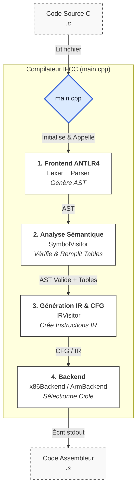
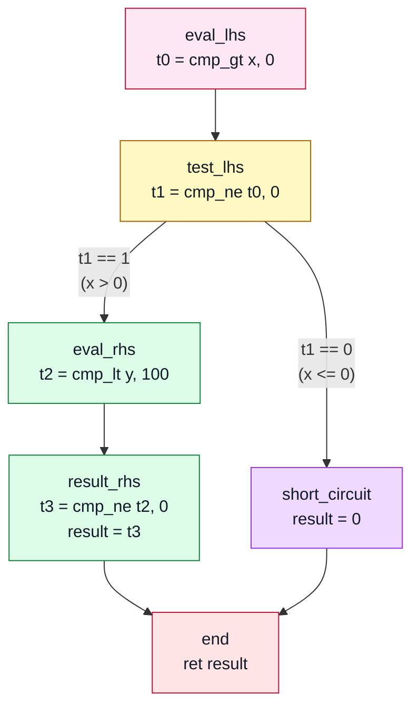
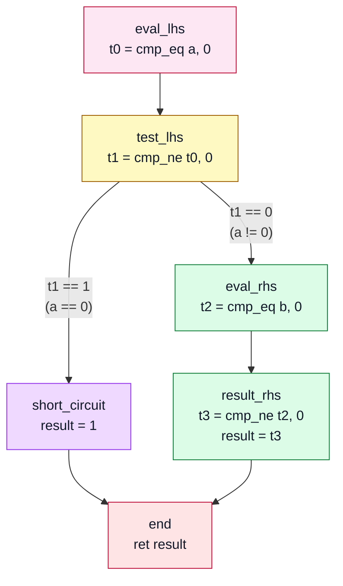
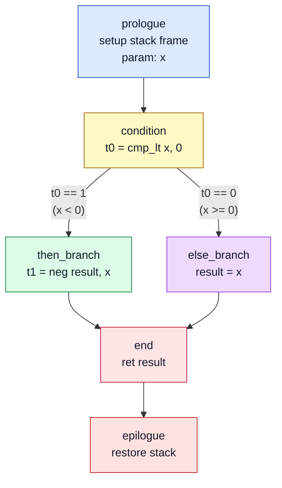
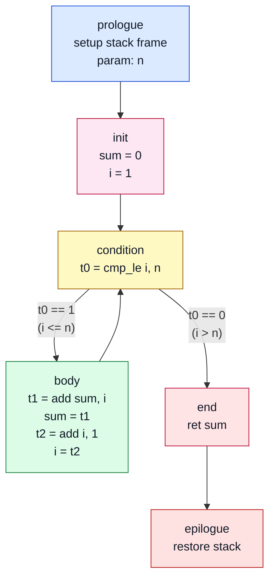
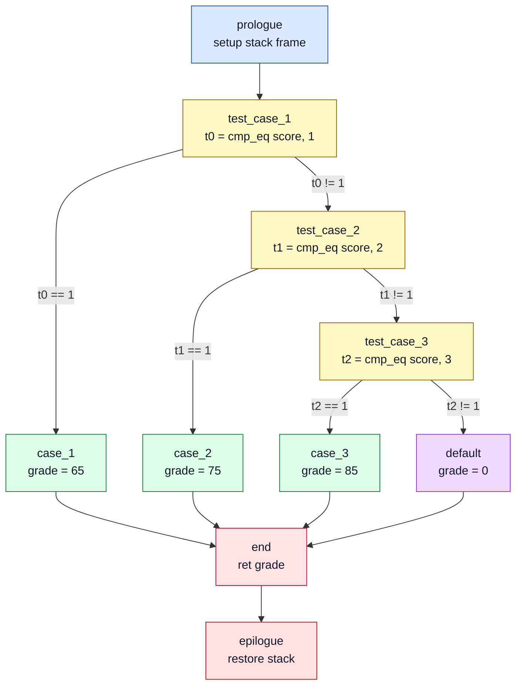
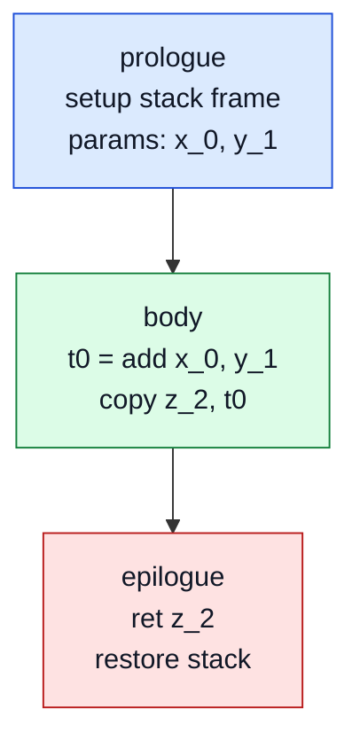
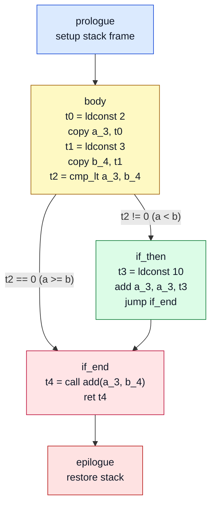

# MAINTENANCE

Ce fichier est volontairement une documentation technique complète du projet.
Il peut être lu comme un manuel d'architecture + pseudo-code de référence.

Objectif principal:

- expliquer clairement le rôle de chaque module
- expliciter les variables d'état importantes
- donner un pseudo-code pour chaque fonction clé redéfinie des passes sémantique et IR

## Disclaimer

Nous avons implémenté des visualisations de CFG dans les différentes parties pour mieux visualiser ce qu'il se passe au niveau de l'IR. Ces visualisations sont très utiles pour comprendre le fonctionnement du compilateur, mais elles ne font pas partie du scope officiel de la maintenance. Elles sont à considérer comme des bonus pédagogiques, et ne sont pas nécessaires pour la compréhension du code ou la réalisation des tâches de maintenance.
Pour visualiser les graphes mermaid en mode preview, nous vous recommandons d'installer une extension qui gère mermaid sur VSCode : [Markdown Preview Mermaid Support](https://marketplace.visualstudio.com/items?itemName=bierner.markdown-mermaid)

## Table des matières

- [1. Vue d'ensemble du compilateur](#1-vue-densemble-du-compilateur)
- [2. Langage supporté (scope officiel)](#2-langage-supporté-scope-officiel)
  - [2.1 Types et fonctions](#21-types-et-fonctions)
  - [2.2 Déclarations](#22-déclarations)
  - [2.3 Expressions supportées](#23-expressions-supportées)
  - [2.4 Contrôle de flux supporté](#24-contrôle-de-flux-supporté)
  - [2.5 Features explicitement non supportées](#25-features-explicitement-non-supportées)
- [3. Structures de données](#3-structures-de-données)
  - [3.1 VariableInfo](#31-variableinfo)
  - [3.2 FunctionInfo](#32-functioninfo)
  - [3.3 ScopeTable](#33-scopetable)
  - [3.4 SymbolTable](#34-symboltable)
  - [3.5 FunctionTable](#35-functiontable)
- [4. SymbolVisitor: specification détaillée](#4-symbolvisitor-specification-détaillée)
  - [4.1 Variables d'état (membres)](#41-variables-détat-membres)
  - [4.2 Helpers](#42-helpers)
  - [4.3 Fonctions visitées, une par une](#43-fonctions-visitées-une-par-une)
- [5. IRVisitor: specification détaillée](#5-irvisitor-specification-détaillée)
  - [5.1 Variables d'état (membres)](#51-variables-détat-membres)
  - [5.2 Helpers](#52-helpers-1)
  - [5.3 Fonctions visitées, une par une](#53-fonctions-visitées-une-par-une)
  - [5.4 Lexique IR](#54-lexique-ir)
- [6. Backend et conséquences du mode int-only](#6-backend-et-conséquences-du-mode-int-only)
- [7. Tests et exécution](#7-tests-et-exécution)
  - [7.1 Build](#71-build)
  - [7.2 Régression recommandée](#72-régression-recommandée)
- [8. Règles d'évolution (ordre obligatoire)](#8-règles-dévolution-ordre-obligatoire)
- [9. Exemple fil-rouge (du source au CFG)](#9-exemple-fil-rouge-du-source-au-cfg)
  - [9.1 Parsing ANTLR](#91-parsing-antlr)
  - [9.2 Passe sémantique SymbolVisitor](#92-passe-sémantique-symbolvisitor)
  - [9.3 Passe IR IRVisitor](#93-passe-ir-irvisitor)
  - [9.4 Visualisation des CFG](#94-visualisation-des-cfg)
  - [9.5 Assembleur x86-64](#95-assembleur-x86-64)

---

## 1. Vue d'ensemble du compilateur

Le compilateur suit 4 étapes strictes.

1. Parsing

- Fichier: `compiler/ifcc.g4`
- Entrée: source C simplifié
- Sortie: AST ANTLR

2. Vérification sémantique

- Fichiers: `compiler/src/SymbolVisitor.h`, `compiler/src/SymbolVisitor.cpp`
- Entrée: AST
- Sortie: erreurs/warnings + tables (`SymbolTable`, `FunctionTable`)

3. Génération IR + CFG

- Fichiers: `compiler/src/IRVisitor.h`, `compiler/src/IRVisitor.cpp`
- Entrée: AST valide + tables sémantiques
- Sortie: un CFG par fonction, représentation intermédiaire du code.

4. Backend

- Fichiers: `compiler/src/backend.h`, `compiler/src/backend.cpp`
- Entrée: CFG/IR
- Sortie: assembleur final

Point d'entrée runtime du compilateur:

- `compiler/main.cpp`

Voici le schéma d'architecture global du projet:



---

## 2. Langage supporté (scope officiel)

### 2.1 Types et fonctions

- types de retour: `int`, `void`
- paramètres: uniquement `int x`
- arité max vérifiée: 6 arguments

### 2.2 Déclarations

- déclaration simple: `int a;`
- déclaration avec init: `int a = expr;`
- déclaration multiple: `int a, b = 1, c;`
- déclaration + assignment dans la même liste: `int a, b = 1, c = b + 2;`
- déclaration possible dans tout bloc

### 2.3 Expressions supportées

- constantes: `INT`, `CHAR`
- variable
- appel de fonction
- affectations: `=`, `+=`, `-=`, `*=`, `/=`
- unaires: `!`, `-`
- pré/post inc-dec: `++x`, `x++`, `--x`, `x--`
- binaires arithmétiques: `+ - * / %`
- comparaisons: `< <= > >= == !=`
- bitwise: `& ^ |`
- logiques court-circuit: `&& ||`

### 2.4 Contrôle de flux supporté

- `if / else`
- `while`
- `switch / case / default`
- `break`, `continue`
- `return`

### 2.5 Features explicitement non supportées

- pointeurs (`*`, `&`)
- tableaux (`a[i]`, déclaration tableau)
- doubles
- propagation de constantes

Nous avons décidé de ne pas implémenter les fonctionnalités non prioritaires et déconseillées.

---

## 3. Structures de données

### 3.1 VariableInfo

```text
name        : nom source (pour messages warning/erreur)
index       : offset pile de la variable
isUsed      : true si la variable est lue/écrite
declLine    : ligne de déclaration (pour warning unused)
```

Utilité pratique:

- name conserve le nom original de la variable pour les diagnostics
- index sert au placement stack
- isUsed + declLine servent au warning de fin d'analyse

### 3.2 FunctionInfo

```text
returnType       : Int ou Void
arity            : nombre de paramètres
paramUniqueNames : noms internes scopes des paramètres
```

Utilité pratique:

- verification d'appels (existence + arité)
- mapping cohérent entre front-end sémantique et IR/backend

### 3.3 ScopeTable

Définition logique: `ScopeTable = vector<map<nom_source, nom_unique>>`

Utilité pratique:

- gère le masquage de variables (shadowing)
- permet une résolution de nom O(nombre_de_scopes)

### 3.4 SymbolTable

Définition logique: `SymbolTable = std::map<std::string, VariableInfo>`

Utilité pratique:

- C'est le dictionnaire global et "aplati" de toutes les variables du programme (et des temporaires de l'IR).
- La clé est le nom unique de la variable (ex: a_0, x_2, tmp1), ce qui évite toute collision liée aux blocs lexicaux.
- Elle est partagée entre le SymbolVisitor (qui la remplit avec les variables sources) et l'IRVisitor (qui s'en sert pour allouer les temporaires et transmettre les offsets corrects au backend).

### 3.5 FunctionTable

Définition logique: `FunctionTable = std::map<std::string, FunctionInfo>`

Utilité pratique:

- C'est le dictionnaire de toutes les fonctions déclarées dans le programme.
- La clé est le nom original de la fonction (ex: add, main).
- Permet au visiteur sémantique de valider les appels de fonctions (CallExpr) : vérification de l'existence de la fonction, correspondance du nombre d'arguments (arité) et respect du type de retour (void vs int).
- Garantit qu'il n'y a pas de redéfinition d'une même fonction et qu'un main est bien présent.

## 4. SymbolVisitor: spécification détaillée

`SymbolVisitor` est la passe de cohérence sémantique.
Puisque notre langage cible ne supporte que des entiers (int), nous n'avons pas besoin d'un système de typage complexe renvoyant les types évalués de chaque nœud.

Le visiteur s'appuie sur le booléen global `hasError` :

- Dès qu'une erreur sémantique est rencontrée (variable non déclarée, appel de fonction inconnu, etc.), on affiche l'erreur et on passe hasError à true.

Le visiteur continue son exécution jusqu'à la fin de l'arbre pour remonter un maximum d'erreurs en une seule passe, évitant ainsi un arrêt brutal à la première faute.

Les méthodes renvoient toutes 0.

Pour les expressions simples (constantes, opérations arithmétiques binaires, unaires, parenthèses) qui ne nécessitent pas de validation des opérandes autres que la descente récursive, nous utilisons l'implémentation par défaut générée par ANTLR (ifccBaseVisitor) qui visite automatiquement les nœuds enfants.

### 4.1 Variables d'état (membres)

```text
table                     : SymbolTable globale des variables uniques
functionTable             : signatures des fonctions
scopeTable                : pile de scopes
currentOffset             : offset pile courant (décroît de 4 en 4)
uniqueVarId               : compteur pour suffixes _0, _1, _2
hasError                  : drapeau global d'erreur sémantique
currentFunctionName       : nom de la fonction en cours
currentFunctionReturnType : type attendu de return
loopDepth                 : profondeur while
switchDepth               : profondeur switch
```

### 4.2 Helpers

#### resolveVariable(originalName)

Responsabilité: trouver le nom interne visible depuis le scope courant.

```text
resolveVariable(name):
  pour i de scopeTable.size-1 à 0:
    si name dans scopeTable[i]:
      retourner scopeTable[i][name]
  retourner ""
```

#### lookupVariableInfo(originalName)

Responsabilité: obtenir `VariableInfo*` en partant d'un nom source.

```
lookupVariableInfo(name):
  unique = resolveVariable(name)
  si unique == "": retourner null
  si unique absent de table: retourner null
  retourner &table[unique]
```

#### checkUnusedVariables()

Responsabilité: émettre les warnings unused en fin de passe.

```text
checkUnusedVariables():
  pour chaque (uniqueName, info) dans table:
    si info.isUsed == false:
      afficher warning avec nom de base et ligne
```

### 4.3 Fonctions visitées, une par une

**Navigation rapide :**

- [visitProg](#visitprog)
- [visitFunction_decl](#visitfunction_decl)
- [visitBlock](#visitblock)
- [visitDeclare_elmt](#visitdeclare_elmt)
- [visitAssign_stmt](#visitassign_stmt)
- [visitReturn_stmt](#visitreturn_stmt)
- [visitVarExpr](#visitvarexpr)
- [visitAssignExpr](#visitassignexpr)
- [visitMultDivModExpr](#visitmultdivmodexpr)
- [visitPreIncDecVarExpr et visitPostIncDecVarExpr](#visitpreincdecvarepr-et-visitpostincdecvarepr)
- [visitCallExpr](#visitcallexpr)
- [visitBreak_stmt et visitContinue_stmt](#visitbreak_stmt-et-visitcontinue_stmt)
- [visitWhile_stmt](#visitwhile_stmt)
- [visitSwitch_stmt](#visitswitch_stmt)

#### visitProg

Responsabilité: prédéclarer toutes les signatures, vérifier doubles, forcer la présence de main.

```text
visitProg(ctx):
  pour fn dans programme:
    si fn.nom deja dans functionTable:
      erreur doublon
    sinon:
      functionTable[fn.nom] = {returnType, arity, [], []}

  si main absent:
    erreur

  pour fn dans programme:
    visit(fn)

  checkUnusedVariables()
  return 0
```

#### visitFunction_decl

Responsabilité: initialiser le contexte fonction et allouer les paramètres.

```text
visitFunction_decl(ctx):
  currentFunctionName = ctx.nom
  currentFunctionReturnType = parseReturnType(ctx.type)
  push scope local fonction

  reset paramUniqueNames pour cette signature

  pour param dans ctx.params:
    si param.nom deja dans scope courant:
      erreur
      continue

    unique = param.nom + "_" + uniqueVarId++
    scopeTable.top[param.nom] = unique

    currentOffset -= 4
    table[unique] = {name=param.nom, index=currentOffset, isUsed=false, declLine=ligne}

    enregistrer unique dans functionTable

  visit(ctx.block)
  pop scope
  return 0
```

#### visitBlock

Responsabilité: gérer l'ouverture/fermeture d'un scope lexical.

```text
visitBlock(ctx):
  push scope
  pour stmt dans ctx.stmts:
    visit(stmt)
  pop scope
  return 0
```

#### visitDeclare_elmt

Responsabilité: créer une variable ou la créer et l'initialiser en même temps.

```text
visitDeclare_elmt(ctx):
  si ctx est VAR:
    registerVariable(VAR, line)
    return 0

  si ctx est assign_stmt:
    registerVariable(VAR, line)
    si pas d'erreur:
        visit(assign_stmt)
  return 0
```

#### visitAssign_stmt

Responsabilité: vérifier l'affectation à l'intérieur d'une déclaration globale.

```text
visitAssign_stmt(lhs, rhs):
  visit(rhs)
  unique = resolveVariable(lhs)
  si unique introuvable: erreur
  table[unique].isUsed = true
  return 0
```

#### visitReturn_stmt

Responsabilité: valider la cohérence entre le type de retour défini et ce qui est retourné.

```text
visitReturn_stmt(ctx):
  si fonction void:
    si expr presente: erreur; visit(expr)
    retourner 0

  # fonction int
  si expr absente: erreur
  sinon: visit(expr)
  return 0
```

#### visitVarExpr

Responsabilité: vérifier l'existence de la variable, la marquer utilisée.

```text
visitVarExpr(name):
  unique = resolveVariable(name)
  si unique introuvable: erreur; return 0
  table[unique].isUsed = true
  return 0
```

#### visitAssignExpr

Responsabilité: valider que la partie gauche est déclarée avant affectation.

```text
visitAssignExpr(lhs, op, rhs):
  visit(rhs)
  unique = resolveVariable(lhs)
  si unique introuvable: erreur; return 0
  table[unique].isUsed = true
  return 0
```

#### visitMultDivModExpr

Responsabilité: déléguer aux enfants, prévenir en cas de division/modulo constant par 0.

```text
visitMultDivModExpr(lhs, op, rhs):
  visit(lhs)
  visit(rhs)

  si rhs est constante ET (op == / OU op == % ) ET rhs == 0:
    warning

  return 0
```

#### visitPreIncDecVarExpr et visitPostIncDecVarExpr

Responsabilité: exiger l'existence de la variable ciblée.

```text
visitPre/PostIncDecVarExpr(var):
  unique = resolveVariable(var)
  si introuvable: erreur; return 0
  table[unique].isUsed = true
  return 0
```

#### visitCallExpr

Responsabilité: vérifier existence de la fonction appelée, arité correspondante, et retours void.

```text
visitCallExpr(funcName, args):
  argc = args.size
  si argc > 6: erreur

  si funcName == putchar:
    si argc != 1: erreur
  sinon si funcName == getchar:
    si argc != 0: erreur
  sinon:
    si fonction absente: erreur
    sinon si arité != argc: erreur
    si returnType == void ET appel utilise comme expression:
      erreur

  pour arg dans args:
    visit(arg)

  return 0
```

#### visitBreak_stmt et visitContinue_stmt

Responsabilité: s'assurer qu'on est bien dans un switch ou une boucle.

```text
visitBreak_stmt:
  si loopDepth == 0 ET switchDepth == 0: erreur
  return 0

visitContinue_stmt:
  si loopDepth == 0: erreur
  return 0
```

#### visitWhile_stmt

Responsabilité: augmenter le niveau de profondeur de boucle pour les branchements.

```text
visitWhile_stmt(cond, body):
  visit(cond)
  loopDepth++
  visit(body)
  loopDepth--
  return 0
```

#### visitSwitch_stmt

Responsabilité: vérifier l'absence de doublons dans les cases, vérifier l'unicité de default.

```text
visitSwitch_stmt(expr, parts):
  visit(expr)

  switchDepth++
  seenCases = {}
  hasDefault = false

  pour part dans parts:
    si part est case:
      value = valeur case
      si value dans seenCases: erreur
      ajouter value
    sinon si part est default:
      si hasDefault: erreur
      hasDefault = true
    sinon si part est statement:
      visit(statement)

  switchDepth--
  return 0
```

---

## 5. IRVisitor: spécification détaillée

`IRVisitor` prend un AST sémantiquement valide et produit l'IR exécuté par le backend.

### 5.1 Variables d'état (membres)

```text
cfgs            : tableau de CFG, un par fonction
cfg             : CFG courant
current_bb      : basic block courant
bb_epilogue     : block epilogue de la fonction courante
table           : SymbolTable partagee (variables + temporaires)
functionTable   : signatures connues
scopeTable      : resolution nom source -> nom unique
currentOffset   : offset pile courant pour temporaires
tempCounter     : compteur tmp0, tmp1, ...
uniqueVarId     : compteur suffixe pour noms locals
breakTargets    : pile de cibles break
continueTargets : pile de cibles continue
```

### 5.2 Helpers

#### createTemp()

Responsabilité: réserver un entier temporaire et l'enregistrer dans table.

```text
createTemp():
  name = "tmp" + tempCounter++
  currentOffset -= 4
  table[name] = {name=name, index=currentOffset, isUsed=true, declLine=0}
  return name
```

#### resolveVariable(name)

Responsabilité: retrouver le nom unique d'une variable source.

```text
resolveVariable(name):
  pour i de scopeTable.size-1 à 0:
    si name dans scopeTable[i]:
      retourner scopeTable[i][name]
  retourner name
```

#### gen_unique_id(ctx)

Responsabilité: fabriquer des labels uniques de blocs via ligne+colonne.

```text
gen_unique_id(ctx):
  retourner "<line>_<column>"
```

### 5.3 Fonctions visitées, une par une

**Navigation rapide :**

- [visitProg](#visitprog-irvisitor)
- [visitFunction_decl](#visitfunction_decl-irvisitor)
- [visitBlock](#visitblock-irvisitor)
- [visitDeclare_elmt](#visitdeclare_elmt-irvisitor)
- [visitAssign_stmt](#visitassign_stmt-irvisitor)
- [visitAssignExpr](#visitassignexpr-irvisitor)
- [visitConstExpr, visitVarExpr, visitParensExpr](#visitconstexpr-visitvarexpr-visitparensexpr-irvisitor)
- [visitPreIncDecVarExpr et visitPostIncDecVarExpr](#visitpreincdecvarepr-et-visitpostincdecvarepr-irvisitor)
- [visitUnitaryExpr](#visitunaryexpr-irvisitor)
- [Opérateurs binaires](#visitaddsubexpr-visitmultdivmodexpr-visitcompareexpr-visitequalexpr-visitlogicbitandexpr-visitlogicbitorexpr-visitlogicbitxorexpr-irvisitor)
- [visitLogicANDExpr](#visitlogicandexpr-court-circuit-irvisitor)
- [visitLogicORExpr](#visitlogicorexpr-court-circuit-irvisitor)
- [visitCallExpr](#visitcallexpr-irvisitor)
- [visitReturn_stmt](#visitreturn_stmt-irvisitor)
- [visitIf_stmt](#visitif_stmt-irvisitor)
- [visitWhile_stmt](#visitwhile_stmt-irvisitor)
- [visitBreak_stmt et visitContinue_stmt](#visitbreak_stmt-et-visitcontinue_stmt-irvisitor)
- [visitSwitch_stmt](#visitswitch_stmt-irvisitor)

#### visitProg (IRVisitor)

Responsabilité: parcourir les fonctions et déléguer leur traduction IR.

```text
visitProg(ctx):
  pour chaque fonction:
    visit(fonction)
```

#### visitFunction_decl (IRVisitor)

Responsabilité: créer CFG + blocs de base, initialiser mapping des paramètres, visiter le corps.

```text
visitFunction_decl(ctx):
  cfg = nouveau CFG(nom, estVoid)
  créer bb_prologue, bb_body, bb_epilogue
  connect prologue -> body
  current_bb = body

  push scope paramètres
  pour chaque param:
    unique = param.nom + "_" + uniqueVarId++
    scopeTable.top[param.nom] = unique
    cfg.paramVarNames.push(unique)
  visit(block)

  si current_bb n'a pas deja de sortie:
    tmp = createTemp(); ldconst tmp, 0; ret tmp; jump epilogue

  pop scope
```

#### visitBlock (IRVisitor)

Responsabilité: ouvrir/fermer un scope local et visiter les statements.

```text
visitBlock(ctx):
  push scope
  pour stmt dans ctx:
    visit(stmt)
    si current_bb deja termine (sortie posee):
      break
  pop scope
```

#### visitDeclare_elmt (IRVisitor)

Responsabilité: créer un nom unique pour une variable déclarée, gérer déclaration simple et déclaration+assignation.

```text
visitDeclare_elmt(ctx):
  si elmt = VAR:
    unique = VAR + "_" + uniqueVarId++
    scopeTable.top[VAR] = unique
    return

  si elmt = assign_stmt(VAR = expr):
    unique = VAR + "_" + uniqueVarId++
    scopeTable.top[VAR] = unique
    visitAssign_stmt(VAR = expr)
```

#### visitAssign_stmt (IRVisitor)

Responsabilité: générer l'IR d'une affectation dans une déclaration initialisée.

```text
visitAssign_stmt(lhs, rhs):
  r = visit(rhs)
  l = resolve(lhs)
  emit copy l, r
  return l
```

#### visitAssignExpr (IRVisitor)

Responsabilité: générer l'IR des affectations simples et composées.

```text
visitAssignExpr(lhs, op, rhs):
  r = visit(rhs)
  l = resolve(lhs)
  si op == "=": emit copy l, r
  sinon si op == "+=": emit add l, l, r
  sinon si op == "-=": emit sub l, l, r
  sinon si op == "*=": emit mul l, l, r
  sinon si op == "/=": emit div l, l, r
  return l
```

#### visitConstExpr, visitVarExpr, visitParensExpr (IRVisitor)

Responsabilité: convertir les constantes en temporaires IR, résoudre les variables, propager les parenthèses.

```text
visitConstExpr(c):
  t = createTemp()
  emit ldconst t, valeur(c)
  return t

visitVarExpr(v):
  return resolve(v)

visitParensExpr(e):
  return visit(e)
```

#### visitPreIncDecVarExpr et visitPostIncDecVarExpr (IRVisitor)

Responsabilité: générer l'IR des pré/post incréments et décréments.

```text
visitPreIncDecVarExpr(var, op):
  v = resolve(var)
  one = createTemp(); emit ldconst one, 1
  si op == ++: emit add v, v, one
  sinon: emit sub v, v, one
  return v

visitPostIncDecVarExpr(var, op):
  v = resolve(var)
  old = createTemp(); emit copy old, v
  one = createTemp(); emit ldconst one, 1
  si op == ++: emit add v, v, one
  sinon: emit sub v, v, one
  return old
```

#### visitUnitaryExpr (IRVisitor)

Responsabilité: générer l'IR des opérations unaires (`-`, `!`).

```text
visitUnitaryExpr(op, e):
  x = visit(e)
  d = createTemp()
  si op == "-": emit neg d, x
  sinon: emit not_ d, x
  return d
```

#### visitAddSubExpr, visitMultDivModExpr, visitCompareExpr, visitEqualExpr, visitLogicBitANDExpr, visitLogicBitORExpr, visitLogicBitXORExpr (IRVisitor)

Responsabilité: générer l'IR des opérations binaires arithmétiques, de comparaison et bitwise.

```text
visitBinary(op, lhs, rhs):
  l = visit(lhs)
  r = visit(rhs)
  d = createTemp()
  emit operation(op) d, l, r
  return d
```

#### visitLogicANDExpr (court-circuit, IRVisitor)

Responsabilité: implémenter l'évaluation court-circuit de `&&`.

```text
visitLogicANDExpr(lhs, rhs):
  dest = createTemp()
  zero = createTemp(); ldconst zero, 0
  left = visit(lhs)
  leftBool = createTemp(); cmp_ne leftBool, left, zero

  créer bb_rhs, bb_false, bb_end
  branch sur leftBool: vrai->bb_rhs, faux->bb_false

  bb_false: ldconst dest, 0; jump bb_end
  bb_rhs  : right = visit(rhs)
            rightBool = createTemp(); cmp_ne rightBool, right, zero
            copy dest, rightBool
            jump bb_end

  current_bb = bb_end
  return dest
```

##### Exemple : programme avec opérateur && (court-circuit)

```c
int isValidRange(int x, int y) {
    int result;
    if (x > 0 && y < 100) {
        result = 1;
    } else {
        result = 0;
    }
    return result;
}
```

##### CFG pour (x > 0 && y < 100)



**Court-circuit:** Si `x <= 0` (lhs faux), le rhs n'est jamais évalué - on saute directement à la valeur 0.

#### visitLogicORExpr (court-circuit, IRVisitor)

Responsabilité: implémenter l'évaluation court-circuit de `||`.

```text
visitLogicORExpr(lhs, rhs):
  dest = createTemp()
  zero = createTemp(); ldconst zero, 0
  left = visit(lhs)
  leftBool = createTemp(); cmp_ne leftBool, left, zero

  créer bb_true, bb_rhs, bb_end
  branch sur leftBool: vrai->bb_true, faux->bb_rhs

  bb_true: ldconst dest, 1; jump bb_end
  bb_rhs : right = visit(rhs)
           rightBool = createTemp(); cmp_ne rightBool, right, zero
           copy dest, rightBool
           jump bb_end

  current_bb = bb_end
  return dest
```

##### Exemple : programme avec opérateur || (court-circuit)

```c
int isSpecial(int a, int b) {
    int result;
    if (a == 0 || b == 0) {
        result = 1;
    } else {
        result = 0;
    }
    return result;
}
```

##### CFG pour (a == 0 || b == 0)



**Court-circuit:** Si `a == 0` (lhs vrai), le rhs n'est jamais évalué - on saute directement à la valeur 1.

#### visitCallExpr (IRVisitor)

```text
visitCallExpr(func, args):
  dest = createTemp()
  params = [func, dest]
  pour arg dans args:
    params.push(visit(arg))
  emit call params
  return dest
```

#### visitReturn_stmt (IRVisitor)

```text
visitReturn_stmt(ctx):
  si expr presente:
    v = visit(expr)
  sinon:
    v = createTemp(); ldconst v, 0
  emit ret v
  jump bb_epilogue
  return v
```

#### visitIf_stmt (IRVisitor)

Responsabilité: créer les blocs condition/then/else/end et connecter les branches.

```text
visitIf_stmt(cond, thenStmt, elseStmt?):
  créer bb_cond, bb_then, bb_end, (optionnel bb_else)
  jump vers bb_cond
  bb_cond.test = visit(cond)
  branch bb_cond -> bb_then / bb_else(ou bb_end)

  bb_then: visit(thenStmt); si pas de sortie, jump bb_end
  si else:
    bb_else: visit(elseStmt); si pas de sortie, jump bb_end

  current_bb = bb_end
```

##### Exemple : programme avec if/else

```c
int absVal(int x) {
    int result;
    if (x < 0) {
        result = -x;
    } else {
        result = x;
    }
    return result;
}
```

##### CFG pour absVal(x)



**Structure:** Diamond pattern classique (prologue, condition, then, else, end, epilogue).

#### visitWhile_stmt (IRVisitor)

Responsabilité: créer les blocs cond/body/end et gérer les piles `breakTargets` et `continueTargets`.

```text
visitWhile_stmt(cond, body):
  créer bb_cond, bb_body, bb_end
  jump vers bb_cond
  bb_cond.test = visit(cond)
  branch bb_cond -> bb_body / bb_end

  push breakTargets(bb_end)
  push continueTargets(bb_cond)

  bb_body: visit(body)
  si pas de sortie: jump bb_cond

  pop continueTargets
  pop breakTargets
  current_bb = bb_end
```

##### Exemple : programme avec while

```c
int sumN(int n) {
    int sum = 0;
    int i = 1;
    while (i <= n) {
        sum = sum + i;
        i = i + 1;
    }
    return sum;
}
```

##### CFG pour sumN(n)



**Structure:** Loop pattern classique (prologue, init, condition, body, back-edge vers condition, end, epilogue).

#### visitBreak_stmt et visitContinue_stmt (IRVisitor)

Responsabilité: générer les sauts vers les cibles courantes de `break` et `continue`.

```text
visitBreak_stmt:
  jump breakTargets.top

visitContinue_stmt:
  jump continueTargets.top

Précondition: la passe sémantique garantie la validité du contexte de saut.
```

**Points clés :**

- `continueTargets` = où aller avec `continue`
- `breakTargets` = où aller avec `break`

#### visitSwitch_stmt (IRVisitor)

Responsabilité: évaluer l'expression switch, créer chaine de dispatch vers chaque case, supporter fallthrough et break.

```text
visitSwitch_stmt(expr, parts):
  switchVal = visit(expr)
  bb_end = new block

  extraire toutes les labels case/default dans des blocks dedies
  créer un premier block de dispatch

  pour chaque case i:
    cst = ldconst(caseValue)
    cond = cmp_eq(switchVal, cst)
    branch cond -> caseBlock[i], nextDispatchOrDefaultOrEnd

  push breakTargets(bb_end)

  parcourir parts dans l'ordre source:
    quand label rencontre, positionner current_bb sur son block
    sur chaque stmt, visit(stmt)
    laisser le fallthrough si aucun jump explicite

  si dernier block actif sans sortie: jump bb_end
  pop breakTargets
  current_bb = bb_end
```

##### Exemple : programme avec switch

```c
int getGrade(int score) {
    int grade;
    switch (score) {
        case 1:
            grade = 65;
            break;
        case 2:
            grade = 75;
            break;
        case 3:
            grade = 85;
            break;
        default:
            grade = 0;
    }
    return grade;
}

int main() {
    int result = getGrade(2);
    return result;
}
```

##### CFG pour getGrade(2)



**Structure:** 11 blocs (prologue, 3 blocs test, 3 blocs case, 1 bloc default, 1 bloc end, epilogue) avec chaîne de branchements.

### 5.4 Lexique IR

L'IR est une **représentation intermédiaire totalement indépendante de l'architecture** cible (x86, ARM, RISC-V, etc.).

**Instructions IR disponibles :**

| Instruction | Format                                          | Sémantique                      |
| ----------- | ----------------------------------------------- | ------------------------------- |
| `ldconst`   | `ldconst <dest> <imm>`                          | Charge une constante entière    |
| `copy`      | `copy <dest> <src>`                             | Copie une valeur                |
| `add`       | `add <dest> <lhs> <rhs>`                        | Addition arithmétique           |
| `sub`       | `sub <dest> <lhs> <rhs>`                        | Soustraction arithmétique       |
| `mul`       | `mul <dest> <lhs> <rhs>`                        | Multiplication arithmétique     |
| `div`       | `div <dest> <lhs> <rhs>`                        | Division entière                |
| `mod`       | `mod <dest> <lhs> <rhs>`                        | Modulo                          |
| `neg`       | `neg <dest> <src>`                              | Négation unaire                 |
| `not_`      | `not_ <dest> <src>`                             | Négation logique (booléenne)    |
| `cmp_lt`    | `cmp_lt <dest> <lhs> <rhs>`                     | Comparaison < (résultat 0 ou 1) |
| `cmp_le`    | `cmp_le <dest> <lhs> <rhs>`                     | Comparaison <=                  |
| `cmp_gt`    | `cmp_gt <dest> <lhs> <rhs>`                     | Comparaison >                   |
| `cmp_ge`    | `cmp_ge <dest> <lhs> <rhs>`                     | Comparaison >=                  |
| `cmp_eq`    | `cmp_eq <dest> <lhs> <rhs>`                     | Comparaison ==                  |
| `cmp_ne`    | `cmp_ne <dest> <lhs> <rhs>`                     | Comparaison !=                  |
| `bit_and`   | `bit_and <dest> <lhs> <rhs>`                    | ET bitwise                      |
| `bit_or`    | `bit_or <dest> <lhs> <rhs>`                     | OU bitwise                      |
| `bit_xor`   | `bit_xor <dest> <lhs> <rhs>`                    | XOR bitwise                     |
| `branch`    | `branch <cond> <bb_true> <bb_false>`            | Bifurcation conditionnelle      |
| `jump`      | `jump <bb_target>`                              | Saut inconditionnel             |
| `call`      | `call <func_name> <dest> [<arg1>, <arg2>, ...]` | Appel de fonction               |
| `ret`       | `ret <value>`                                   | Retour de fonction              |

**Variables symboliques :**

- **Temporaires :** `t0, t1, t2, ...` (créées lors de l'évaluation d'expressions)
- **Variables locales :** `varname_0, varname_1, ...` (suffixes uniques pour gérer le shadowing)
- **Paramètres :** `param_0, param_1, ...` (noms de paramètres avec suffixes uniques)

**Propriétés clés de l'IR :**

1. **Architecture-agnostique** : l'IR ne mentionne jamais de registres (rax, rbx, etc.)
2. **Noms symboliques** : les variables sont identifiées par nom, pas par adresse physique
3. **Offset indépendant** : l'allocation de pile vient du backend, pas de l'IR
4. **Blocs de base explicites** : chaque instruction a une destination connue (bb_next ou bb_else pour les branches)

---

## 6. Backend et conséquences du mode int-only

Le backend reste compatible avec des structures historiques plus larges, mais le front-end actuel n'émet que:

- des valeurs entières
- des opérations arith/logiques/comparaison entières
- des sauts de contrôle classiques

---

## 7. Tests et exécution

### 7.1 Build

```bash
cd compiler
make clean
make
```

### 7.2 Régression recommandée

```bash
python3 ifcc-test.py testfiles
```

Note: `testfiles/undefined` peut produire des résultats différents selon le compilateur, la version et la plate-forme (comportement C non défini). Cette catégorie ne doit pas être utilisée comme oracle strict.

---

## 8. Règles d'évolution (ordre obligatoire)

Si une nouvelle fonctionnalité est ajoutée:

1. Créer un dossier `not_implemented/` dans la catégorie de tests de la fonctionnalité et y placer les nouveaux cas
2. Étendre `ifcc.g4` minimalement
3. Ajouter/adapter les règles sémantiques dans `SymbolVisitor`
4. Ajouter la génération IR dans `IRVisitor`
5. Une fois les tests au vert, supprimer `not_implemented/` et déplacer les cas vers `valid/` et `invalid/`
6. Mettre à jour README + ce fichier

**Règle forte:** ne jamais ajouter de génération IR sans barrière sémantique explicite.

---

## 9. Exemple fil-rouge (du source au CFG)

### 9.1 Parsing (ANTLR)

Programme exemple:

```c
int add(int x, int y) {
    int z = x + y;
    return z;
}

int main() {
    int a = 2;
    int b = 3;
    if (a < b) {
        a += 10;
    }
    return add(a, b);
}
```

Points clé:

- `prog` contient 2 `function_decl`
- la déclaration `int z = x + y;` est un `declare_stmt` contenant un `declare_elmt(assign_stmt)`
- `a += 10` est un `AssignExpr` (opérateur composé)
- `return add(a, b)` est un `Return_stmt` avec `CallExpr`

### 9.2 Passe sémantique (SymbolVisitor)

```text
visitProg
  -> predeclare add/main dans functionTable
  -> visitFunction_decl(add)
     -> scope params x,y
     -> visitDeclare_elmt(z = x + y)
        -> visite via ifccBaseVisitor(x,y)
     -> visitReturn_stmt(return z)
  -> visitFunction_decl(main)
     -> visitDeclare_elmt(a = 2)
     -> visitDeclare_elmt(b = 3)
     -> visitIf_stmt
        -> visite via ifccBaseVisitor(a < b)
        -> visitAssignExpr(a += 10)
     -> visitReturn_stmt(return add(a,b))
        -> visitCallExpr(add,[a,b])
  -> checkUnusedVariables
```

### 9.3 Passe IR (IRVisitor)

Pseudo-trace simplifiée (sans les blocs de prologue/épilogue ni les détails d'allocation de pile (unique pour le backend)):

```text
Fonction add:
entry -> prologue -> body

body:
  t0 = add x_0, y_1
  copy z_2, t0
  ret z_2
  jump epilogue_add

-----------------------------------------

Fonction main:
entry -> prologue -> body

body:
  t1 = ldconst 2
  copy a_3, t1
  t2 = ldconst 3
  copy b_4, t2
  t3 = cmp_lt a_3, b_4
  branch t3 -> if_then / if_end

if_then:
  t4 = ldconst 10
  add a_3, a_3, t4
  jump if_end

if_end:
  t5 = call add, dest=t5, args=[a_3,b_4]
  ret t5
  jump epilogue_main
```

### 9.4 Visualisation des CFG

#### CFG pour add(int x, int y):



**Structure:** 3 blocs linéaires sans branchement.

- Paramètres `x_0`, `y_1` chargés en pile
- Temporaire `t0` pour stocker le résultat de l'addition
- Variable locale `z_2` reçoit le résultat

#### CFG pour main():



**Structure:** 5 blocs avec branchement conditionnel (diamond pattern).

### 9.5 Assembleur x86-64

```assembly
.globl add
 add:
    pushq %rbp
    movq %rsp, %rbp
    subq $48, %rsp
    movl %edi, -4(%rbp)
    movl %esi, -8(%rbp)
    jmp add_body
add_epilogue:
    leave
    ret
add_body:
    movl -4(%rbp), %eax
    movl -8(%rbp), %ebx
    addl %ebx, %eax
    movl %eax, -24(%rbp)
    movl -24(%rbp), %eax
    movl %eax, -12(%rbp)
    movl -12(%rbp), %eax
    jmp add_epilogue
.globl main
 main:
    pushq %rbp
    movq %rsp, %rbp
    subq $48, %rsp
    jmp main_body
main_epilogue:
    leave
    ret
main_body:
    movl $2, -28(%rbp)
    movl -28(%rbp), %eax
    movl %eax, -16(%rbp)
    movl $3, -32(%rbp)
    movl -32(%rbp), %eax
    movl %eax, -20(%rbp)
    jmp main_if_cond11_4
main_if_cond11_4:
    movl -16(%rbp), %eax
    movl -20(%rbp), %ebx
    cmpl %ebx, %eax
    setl %al
    movzbl %al, %eax
    movl %eax, -36(%rbp)
    cmpl $0, -36(%rbp)
    je main_if_end11_4
    jmp main_if_then11_4
main_if_then11_4:
    movl $10, -40(%rbp)
    movl -16(%rbp), %eax
    movl -40(%rbp), %ebx
    addl %ebx, %eax
    movl %eax, -16(%rbp)
    jmp main_if_end11_4
main_if_end11_4:
    movl -16(%rbp), %edi
    movl -20(%rbp), %esi
    call add
    movl %eax, -44(%rbp)
    movl -44(%rbp), %eax
    jmp main_epilogue
```
